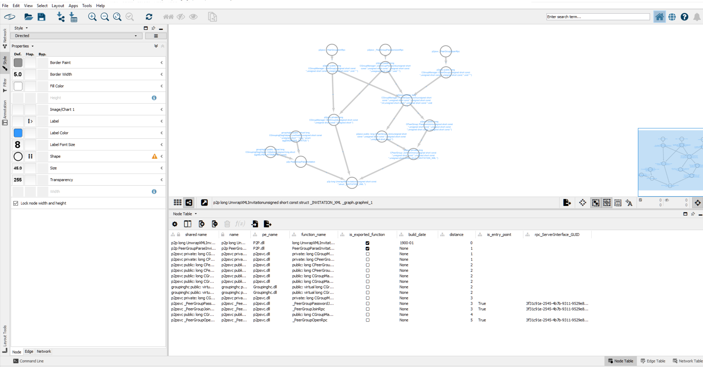

# Back 2 the Future

Find patterns of vulnerabilities on Windows in order to find 0-day and write exploits of 1-days.
We use Microsoft security updates in order to find the patterns. 

## Table of Contents

* [Goal of the project](#goal)
* [Overview Steps](#overview-steps)
* [Installation](#installation)
* [Getting Started](#getting-started)
* [Steps of the tool](#steps-for-execution):
  1. [Download Windows updates](#1-download-windows-updates-and-correlate-them)
  2. [Extract Windows updates](#2-extract-windows-updates)
  3. [Compare binaries](#3-compare-binaries)
  4. [Classify changes](#4-classify-changes)
  5. [Generate graph](#5-graph-call)
* [Utilities](#utilities)
  1. [db merger](#db-merger)
  2. [bindiff extractor](#bindiff-extractor)
  3. [Generate RPC projects](#generate-rpc-projects)
  4. [Generate XXE COM projects](#generate-xxe-com-projects)
  5. [Calculate missing diffs](#calculate-missing-diffs)
* [Architecture](./docs/Architecture.md)
  * [Overview architecture](./docs/Architecture.md#Overview-architecture-of-rank_changes.py)
  *  [Overview Output Directory Tree](./docs/Architecture.md#Overview-output-directory-tree)
* [TL;DR](#tl-dr)
* [Example](#example)
* [Known Issues](#known-issues)
* [Contributions](#contributions)
* [License](#license)

## Goal

There are 2 main goals for this repo: 

* Rapid analysis of security patches in Windows 
* Find new 0-days

## Overview steps

In order to detect all the patch patterns and find 0-days, it is required to do the following steps:
1. **Correlation updates with CVE** (`cve_correlation.py`) - Automatically download all the Windows updates from [Microsoft catalog](https://www.catalog.update.microsoft.com/Home.aspx).
   Our focus is in security only updates (aka Windows 8.1), extracts them and correlate them with windows vulnerabilities published in Microsoft's website. 
2. **Extract Windows updates** (`msu_patch_extractor.py`) - Apply delta-patches, create an executable's folder that contains all the versions of a single file.
3. **Compare binaries** (`auto_patchdiff.py`) - Compare all the changes made in the security updates using Bindiff tool.
4. **Classify changes** (`rank_changes.py`) - Analyze the executables, and the changes made by Microsoft and store the
                                              changes into a single DB
5. **Generate a graph** (`extract_cg.py`) - After you analyzed and found interesting functions, use this tool to extract
                                           [call graph](https://en.wikipedia.org/wiki/Call_graph) in order to detect
                                           which functions are calling to the vulnerable function you found or which
                                           functions the function you found is calling cross binaries
**You can skip steps 1-4 if you'll use the generated DB found in release, see TL DR**

## Installation

The required dependencies on the PC are

### Hardware

* Intel x64 CPU
* About **175 GB** free space
* RAM: 16GB or more (It is plausible that it is working with less than that, but we didn't test that).

### Software

* Windows 10 OS
* Ida pro 7.X (tested on 7.5)
* [Zynamics Bindiff tool](https://www.zynamics.com/bindiff.html) version 6+
* Python 64bit version: 3.6 or 3.8 (Other versions might be supported as well, but we didn't test that on them)

### Python Packages

* `pywin32`
* `pathlib2`
* `pefile`
* `pygments`
* `requests`
* `bs4`
* `lxml`
* `easydict` 
* `cachetools`
* `fuzzywuzzy`
* `rpyc`
* `sark`
* `beautifulsoup4`
* `pyenchant`
* `PyGithub`
* `pefile`

#### Optional python packages

For optimizations:
* `python-Levenshtein`

#### For .Net Decompilation

* dot net framework and *dotnet sdk* (for dotnet.exe)
* ilspy - to install it run the command: `dotnet tool install --global ilspycmd`  
  
### Ida Pro Virtual-Env Dependencies

* `FIDL` - interactions with ida decompiler https://github.com/fireeye/FIDL/tree/master
            see `known issues` to fix it's bug manually
* `sark` - ida api wrapper https://github.com/tmr232/Sark
* `rpyc` - execute rpc on ida process  
* powershell package:`NtObjectManager` to install run the command `Install-Module "NtObjectManager" -Force` 

## Getting Started

### Steps for execution

It is recommended to execute the following codes one by one because there are dependencies between the output of one script to another.
Some of the scripts can take more than 2 days to execute. please be caution.
*By default all the output files of all the codes below writes into the `./logs/` folder.*  
For analysis of all the patches - follow the steps below.

If you only want to generate cross binaries graphs or find patterns in binaries without patch-diffing, go straight 
to step 5, and use Generic FS flag.

### 1 Download Windows updates and correlate them

`cve_correlation.py` - downloads the security updates from the internet, extracts them and correlate the changes to the 
CVEs.
Common arguments:

* `--msuDownload, -m`     Is download the .msu files, Windows security updates
* `--outputMsuName -o`    path to the which the MSU will be downloaded to
* `--doExtract, -x`       Extract msu content to msuExtractedPath folder

Execution time: about **30-60 minutes**
  
### 2 Extract Windows updates

This step has 2 sub-steps:

1. Copy from an old Windows 8.1 the Windows directory, it will serve as a reference for executables we have only few versions of it.
2.Extract all the PEs from the KBs using the script `msu_patch_extractor.py` with the arguments:
    * `--path-winsxs`           - location of the winsxs you downloaded in the previous sub-step
    * `--path-executables`      - folder that contains all the executable versions (symlinks)
    * `--path-kb-folder`        - folder that contains all the KBs (MSUs), the same path as in the previous step.
    * `--include-base-files`    - if you want to include base files, it can add noise to the results,
                                  but you'll have more results.
    * `--path-extract-msu`      - The path you extracted the msu files in the previous step
  
The output of the script will be the path of the executables, and it will extract all the MSU files in the KB folder.
If you'll use `--path-winsxs` it will include base version of all the files in WinSXS.

Execution time about **30-60 minutes**  

### 3 Compare Binaries

`auto_patchdiff.py` - Generate all the diffs between all the patches common arguments: 

* `--path-executables` - pass the same argument as you pass to the script `msu_patch_extractor.py`
* `--path-diffs` - a folder the script will generate all the information about, this folder will *weight a lot*
* `--skip-fails` - if some diff failed it will not terminate the program
                   the diffs between executables found in executables folder
  
**The output of the code will be written to `--path-diffs`, this folder will be HUGE, 150+ GB.**
It contains all files required for bindiff to compare all the versions.

Execution time about 48-36 hours

### 4 Classify changes

`rank_changes.py` - Classify all the changes or patterns from existing directory tree. 
                    The output of this code is an SQL DB with all the [features](./docs/Features.md)

There are 2 main options on which directory trees we can execute it on:

* The executable directory tree, generated by the previous steps, in this format we have versions for each executable, 
  and we compare between all the versions of each version.
* Generic file-system, any folder with executables, such as Windows 10 directory. - it will extract only the patterns, 
  and we won't compare the versions of the same PE.

All the configurations can bypass using arguments or changing the file: `config/default_config.json`

Common parameters:

* `--path-diff`            - Path to the root folder of binary-diffed generated by step 4  
* `--path-executables`     - The path to the executables folder or any folder inside it (for example only x64 executables)
* `--generic-filesystem`   - path-executables points to generic filesystem and non-standard file-system,
  (file-system not built by msu_patch_extractor)
* `--continue-execution`   - continue execution from a specific PE if for some reason the last execution was stopped in the middle.

To execute with additional features that takes more time:

* `--include-cg`          - Is include call graph features (takes lots of time)
* `--include-cg-metadata` - Is scrape information from external sources for the call graph graphs (MSDN and github)
* `--extract-additional-params`  - extract additional params to the DB, unrelated to call graph.

You might need to update the file `config/default_config.json` specially the object `features.pe.cve_link.db_location`
(just close the features object there and you'll see the important configurations).

Execution time about 72+ hours (Can be over **4 days** If you use all the additional features)

### 5 Graph call

`extract_cg.py` - Generate a [call graph](https://en.wikipedia.org/wiki/Call_graph) from or to any function across
                   the entire Windows OS. In order to use it, it is required to add few flags to `rank_changes.py`.
                   So it will extract all the required information.

The output of the code is *.graphml* represent the call graph, you can view it using any software designed to display 
graphs. The best program we found was [cytoscape](https://cytoscape.org/)  


Complicated arguments:

* `--path-api-set`            - Path to the mapping file of the [api-set](https://docs.microsoft.com/en-us/windows/win32/apiindex/windows-apisets)
                              mapping that will be used external dlls, You can use the example mappings found
                              in: `config/windows_*_apisets_mapping` or to generate that yourself
* `--unsafe-xrefs`            - Include in the graph dynamic xrefs, such as GetProcAddress - it might be
                                ambiguous and linked to another PE
* `--direction-cfg-from`      - Is generate the graph from or to the chosen function, if selected - generate CF from the function.
* `--generic-fs`              - If the DB was generated from a generic FS, regular directory tree and not the FS generated by
                              `msu_patch_extractor.py`.

#### Generate api-set mapping:

* mapping between windows apisets supported for WINDOWS 8.1, apisets can be updated using the following tool:
execute `Dependencies.exe -apisets` [Dependencies](https://github.com/lucasg/Dependencies) and copy
the stdout to the configuration .\config\windows\apisets_mapping file.

Execution time about 5 minutes

## TL DR

For view the patterns found without changes -  use the DB found in releases.
It contains only the patterns of Windows 8.1 until the date it was released.

## Example

Execute the following commands, and you'll get the DB with all the changes 

### Assumptions

* current working directory - the root project folder
* view [dependencies](#Installation) and which packages you required to install.
* E:\windows8\Windows - contains Windows 8.1 FS older than the oldest version you downloaded, before 2017.
* In the end of the execution E:\tests - is going to be around **250 GB** or even more, depends on if you're using x64 or all architectures.
* the DB in `.\logs` is going to weight **20 GB+-**.
* **execution time is going to be around 3-4 days, and it is going to be only for x64**.

### Commands

* `python cve_correlation.py -m --msuExtractedPath E:\tests\extracted_path  --dbPath E:\tests\db.db  -x --outputMsuName E:\tests\msu`
* `python msu_patch_extractor.py  -v --path-winsxs E:\windows8\Windows\winsxs --path-executables "E:\tests\executables" --path-kb-folder "E:\tests\msu" --path-extract-msu "E:\tests\extracted_path" -t 3 --include-base-files`
* `python auto_patchdiff.py --path-executables "E:\tests\executables\amd64" --path-diffs E:\tests\diffs --skip-fails`
* In the `default_config.json` edit the object `features.pe.cve_link.db_location` from `.\config\cveDB.db` to the location of the DB: `E:\tests\db.db` 
* `python rank_changes.py --path-executables "E:\tests\executables\amd64" --include-cg --extract-additional-params --path-output-folder "E:\tests\output" --path-diff E:\tests\diffs`
* The output DB will be in `.\logs\ranks.db`

## Utilities

### db merger

`utilities\db_merger.py` - Merge one DB into the other DB

### Bindiff extractor

`utilities\bindiff_extractor.py` - Let you copy the bindiff directory tree without breaking symbols from one PC to another. 

### Generate RPC projects

See [rpc\README.md](./rpc/README.md)

### Generate XXE COM projects

See [xxe\usage_example.md](./xxe/usage_example.md)

### Calculate missing diffs

`utilities\calculate_missing_diffs.py` - Calculate the amount of existing diffs vs the existing diffs.
Sometimes Bindiff tool has failed to calculate the diffs, so we want to quantify the amount of the missing diffs. 

## Known Issues

* do not run it inside IDE, pycharm had memory leak and crashed because of that script when executing CG as well.
* bin-diffing, secondary view is the newer, in the SQL it is address2.
* bindiff compare db (the sql) in table functions doesn't always writes the start of the function
  example: centel.dll	a..de-compat-telemetry_centel.dll	6.3.9600.19809	4577071	2020-09	private: static long wil::details_abi::SemaphoreValue::GetValueFromSemaphore(void *,long *)	6442477186

* FIDL have at least 2 bugs,
    * https://github.com/fireeye/FIDL/issues/10
    * sometimes the decompiler fails and it gets None instead of other value - no workaround 
    * index outbound add to the condition the following case `and len(case_ins) > 1:`
``` 
  if succ:
        # u -> break => u -> succ
        self.i_cfg.add_edge(case_ins[-2].index, succ)
```
* gdiplus.dll has 3 major versions 1.0,1,1, 6.3 but only 2 packages. 

* recommendation for ida decompiler:
    in file: %idadir%\cfg\hexrays.cfg
    update the config MAX_NCOMMAS from 8 to 0.
https://www.hex-rays.com/products/decompiler/manual/config.shtml

## Contributions

* Eran Segal
* Tomer Bar
* @jgeigerm in core\delta_patch.py, utilities\PatchExtract.ps1 - https://wumb0.in/extracting-and-diffing-ms-patches-in-2020.html

## License

See License file
