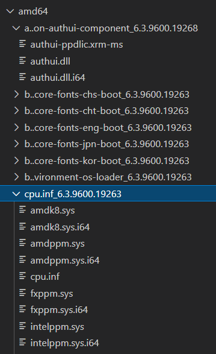

# Architecture
## Overview project directory tree
* cfg_extractor\                - 
* compare\                      - 
* config\                       - The configuration files
  * windows_8_1_apisets_mapping - A config for the call graph utility if you're generating a graph for Windows 8.1  
  * windows_10_apisets_mapping  - A config for the call graph utility if you're generating a graph for Windows 10
  * default_config.json         -  
* core\                         - 
* docs\                         -  
* features\                     - All the features, the part that detect the changes and patterns of the `rank_changes.py`
  * global_features\            - Global features are specific type of features, relevant the entire version of a PE or in a bigger scope than a single type of executable.    
  * pe_features\                - PE features are type of feature, these features looks for the scope of specific PE or it's versions (for example all the COM objects used in the PE) 
  * function_features\          - Function features are type of feature, these features looks for a changes/patterns in the functions themselves, for example: a new function call was added in a function between versions of the same PE.     
  * dotnet_features\            - Features that are relevant only for .Net executables 
* integrations\                 - All the external integrations with different software, such as Ida Python.  
* logs\                         - All the outputs of the code, logs will be written to this folder. 
* utilities\                    - A set of multiple useful scripts that can help you  
  * rpc                         - A utility that generates POCs of RPC calls 
  * com                         - A utility that search for vulnerable COM objects
  
## Overview output directory tree
The entire directory tree weights relatively a lot because we're looking on all the versions of all the files in Windows.
In addition, for each version we're adding an IDB file and Bin-diff file for each compare. 

* KBs                                         - Folder that contains all the extracted Windows updates  
  * YEAR                                      - All the security updates are classified into years   
    * YYYY_MM_windowsVersion-kbNUMBER-x64.msu - In each year found all the related security only updates,`msu` files 
    * YYYY_MM_windowsVersion-kbNUMBER-x64     - A folder contains all the extracted files from the MSU file
        * *amd64                              - All the updated native x64 files 
          * PACKAGE_NAME_version              - All the files in the package (executables and non-executables)
            * PE_NAME                         - the updated PE
            * PE_NAME.i64                     - IDB of the PE 
        * JUNK                                - not interesting folder 
        * MSIL                                - All the Dot-Net executables. Same format as amd64 folder  
          * PACKAGE_NAME_version              - All the files in the package (executables and non-executables)
            * PE_NAME                         - the updated PE
        * PATCH                               - not interesting folder
        * wow64                               - All the updated [WOW64](https://en.wikipedia.org/wiki/WoW64) files
          * ...                                     - Same as amd64
        * x86                                 - All the updated x86 files 
          * ...                                     - Same as amd64
    
* diffs                                       - A folder contains all the comparisons
  * amd64                                     - All the comparisons of all the native x64 binaries
      * PACKAGE_NAME_PE_NAME                  - name of the package of the PE and the pe name  
        * YYYY-MM_VERSION_vs_YYYY-MM_VERSION  - A single compare between 2 versions  
          * VERSION_PACKAGE_PE_vs_VERSION_PACKAGE_PE.Bindiff  - Bindiff compare file useful for importing it into bindiff tool.
          * ....                              - Other not interesting files
  * wow64                                     - All the comparisons of all the native wow64 binaries
    * ...                                     - Same as amd64
  * x86                                       - All the comparisons of all the native x86 binaries
    * ...                                     - Same as amd64
  
* executables                                 - Contains all the versions of all the executables ordered by PE name
  * amd64                                     - All the X64 executables 
    * PACKAGE_PE_NAME                         - A folder contains all the versions we have about this PE
      * YYYY-MM_kbNUMBER_VERSION_PE_NAME.symlink - symlink to the version of this specific PE 
  * wow64                                     - All the wow64 executables 
    * ...                                     - Same as amd64
  * x86                                       - All the wow64 executables
    * ...                                     - Same as amd64
  
* output                                      - Some features have output which we can't insert into the DB, so they'll write it into this folder 
  * FEATURE_NAME                                

### Examples
* KB directory tree

* executables directory tree

  
* bin-diff directory tree

  

